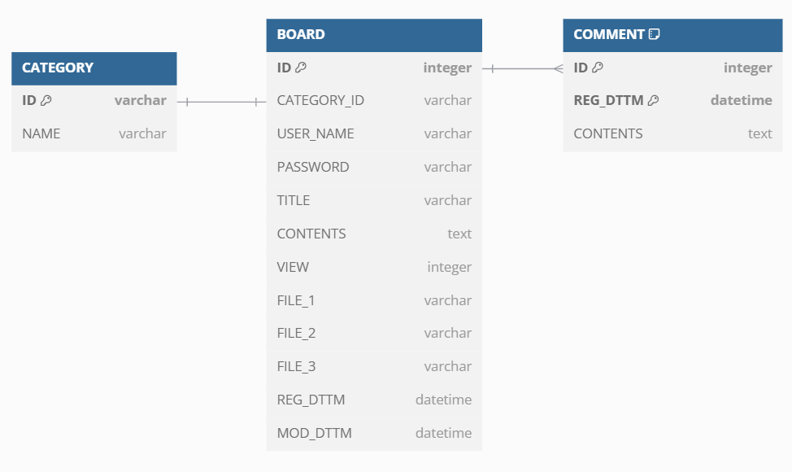

# 사전 준비

## JDK 11 설치

## Docker Desktop 설치
https://www.docker.com/products/docker-desktop/

## Apache Tomcat 설치
https://tomcat.apache.org/download-10.cgi

## Docker Compose 실행 - MySql
``` 
cd help
docker-compose up -d
```
## Docker root password 찾기
```
docker exec [컨테이너명] env
```

# 프로젝트 소개
- JSP / Servlet 게시판을 Model-2 MVC, Command 패턴을 적용하여 개발
- 게시판 목록 조회, 상세 조회, 등록, 수정, 삭제를 구현
- Java / JSP / Servlet / Mysql / JDBC / git

## 기간
2025.02.17(월) ~ 2025.02.21(금)

## JSP / Servlet 프로젝트를 하는 이유
#### 1. 웹 개발의 기초 이해
JSP와 Servlet은 Java 기반 웹 개발의 기본적인 기술.<br>
Spring이 있지만 결국 내부적으로 Servlet을 기반으로 동작.<br>
따라서 JSP와 Servlet에 대해 알면 Spring이 내부적으로 어떻게 동작하는지 더 쉽게 이해.

#### 2. HTTP 요청/응답 처리 개념 학습
Spring을 사용하면 어노테이션으로 쉽게 요청 처리 가능.<br>
하지만 그 전에 JSP / Servlet을 사용하면 HTTP 요청-응답 흐름을 깊이 이해.

#### 3. 기본적인 웹 애플리케이션 구조 익히기
MVC 패턴을 적용하는 방법<br>
DAO(Data Access Object) 패턴을 활용하여 DB와 연동<br>
위와 같은 기본적인 웹 애플리케이션 구조 습득

## DB 구조


## 이슈
- Tomcat version 수정 (02.17 해결)
  - tomcat 9는 Servlet 4.0을 지원하고 javax.* 패키지를 사용
  - tomcat 10은 Servlet 5.0을 지원하고 jakarta.* 패키지를 사용
  - build.gradle에 jakarta를 사용하고 있기 때문에 tomcat 10으로 변경
- [lombok 추가 안됨 (02.19 해결)](https://velog.io/@sun-8/jspservlet-lombok-추가-안됨)
- [jstl 적용 안됨 (02.20 해결)](https://velog.io/@sun-8/jspservlet-jstl추가-안됨)
- [jsp 파일들을 WEB-INF 폴더 안으로 넣었더니 JDBC 오류 발생 (03.01 해결)](https://velog.io/@sun-8/jspservlet-jsp-파일을-WEB-INF-폴더-안에-위치-후-JDBC-오류)

## Command Pattern
행동(behavioral) 패턴 중 하나.<br>
요청을 객체의 형태로 캡슐화하여 재이용하거나 취소할 수 있도록 요청에 필요한 정보를 저장하거나 로그에 남기는 패턴<br>
요청에 사용되는 각종 명령어들을 추상 클래스와 구체 클래스로 분리하여 단순화<br>
1. Command : 인터페이스. 요청을 수행하는 메서드를 정의
2. ConcreteCommand : 인터페이스를 구현한 클래스. 실제로 요청을 처리하는 작업
3. Receiver : 실제 작업을 수행하는 객체. 핵심 로직 구현
4. Invoker : 사용자의 요청을 Command 객체로 변환. 이 객체에 저장하고 실행하는 역할

- [Command.java](/src/main/java/com/study/web/command/Command.java) => Command
- [BoardListCommand.java](/src/main/java/com/study/web/command/board/BoardListCommand.java) => ConcreteCommand
- [BoardService.java](/src/main/java/com/study/web/service/BoardService.java) => Receiver
- [BoardController.java](/src/main/java/com/study/web/controller/BoardController.java) => Invoker

## service - serviceImpl VS service
이 프로젝트에서 service와 serviceImpl을 사용할지, service만 사용할지를 고민해보았다.<br>
인터페이스와 이를 구현한 클래스의 구조는 캡슐화의 이점도 있지만 다향성에 큰 이점이 있다고 생각한다.<br>
List 인터페이스에는 ArrayList, LinkedList, ...가 있듯 하나의 인터페이스를 여러 클래스에 사용했을 때 더 빛을 바란다고 생각한다.<br>
그런데 이 service - serviceImpl은 1:1 구조이기 때문에 코드만 더 복잡하게 만드는 것이라고 생각하여 service만 사용하기로 했다.

## jsp 파일들을 WEB-INF/로 위치시키는 이유
1. 직접 접근 제한 (Access Restriction)
  - WEB-INF 폴더는 클라이언트(브라우저)에서 직접 접근할 수 없는 보호된 경로.
  - http://localhost:8080/WEB-INF/index.jsp 로 접근해도 404 발생.
  - jsp 파일을 WEB-INF 폴더 안에 두면 클라이언트가 직접 접근하지 못하도록 보호 가능.
  - 즉 servlet을 거쳐야만 접근이 가능
2. 보안 강화 (Security)
   - jsp 파일을 WEB-INF 폴더 밖에 두면 클라이언트가 직접 접근 가능해서 jsp 내부에서 처리하는 로직이 노출될 가능성 있음.
   - 민감한 페이지(관리자페이지 같은..)는 WEB-INF 폴더 안에 두는 것이 안전.

## 후기
Command 패턴을 이해하고 적용하는 데에 시간을 많이 썼다.<br>
비록 게시판 목록만 구현했지만 Command 패턴을 구현함으로써 Servlet의 한계와 Spring을 사용한 이유에 대해 알 수 있었다.
